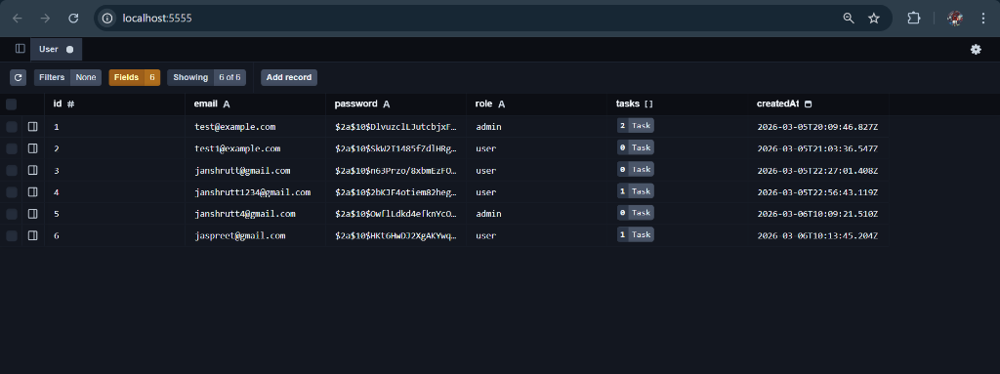
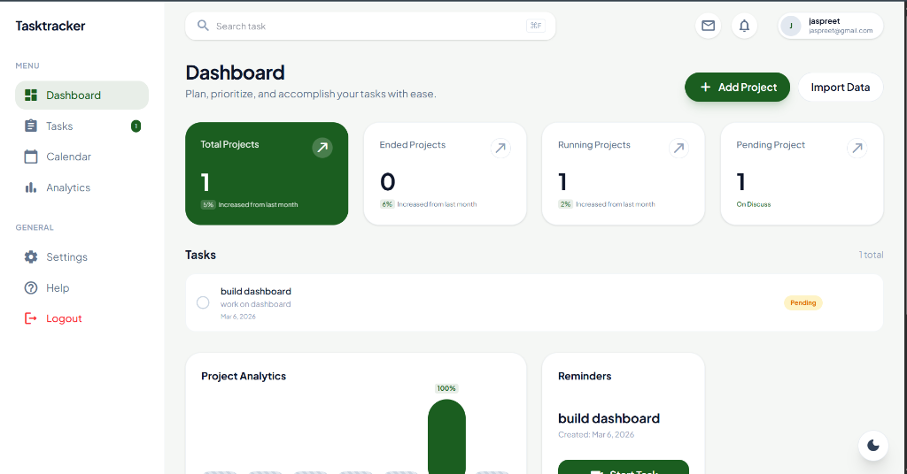
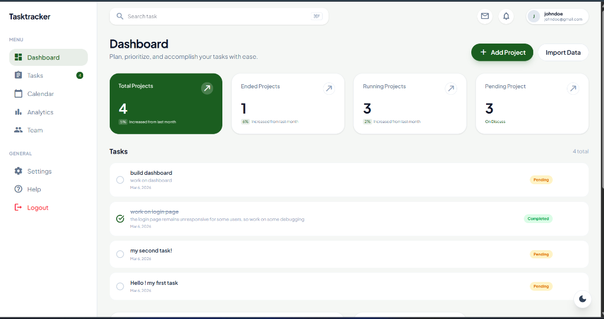
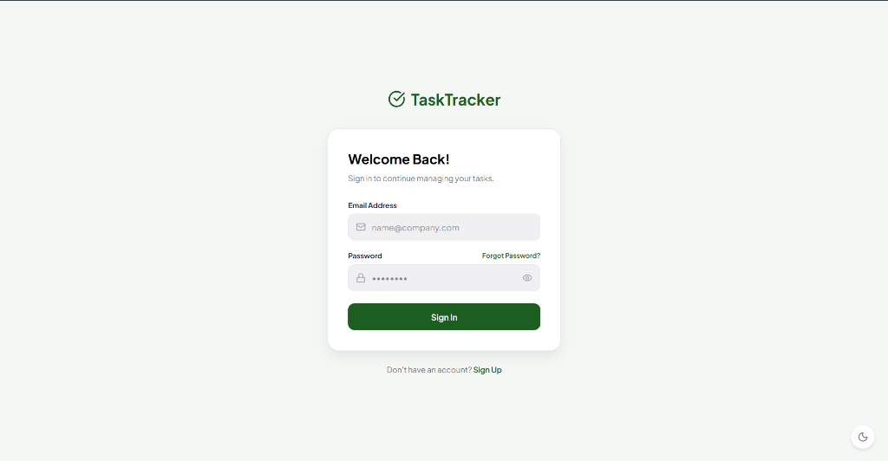

# Task Tracker

A full-stack, comprehensive task management application designed for modern teams and individuals. Built with a robust backend and a highly responsive, aesthetically pleasing frontend, this project demonstrates production-ready patterns, secure authentication, and seamless user experiences.

## 📸 App Screenshots

Below are some screenshots showcasing the working application. *(To render these correctly, please save the provided images into a `screenshots/` directory at the root of the project with the corresponding filenames).*

### Admin Users List


### User Dashboard (Jaspreet)


### Alternate Dashboard View (Admin)


### Login Page



## 🚀 Features

- **Role-Based Access Control (RBAC):** Distinct roles for `Admin` and `User` ensure that data access is tightly controlled. 
  - Admins can view and manage all tasks.
  - Users can create, view, and manage their own tasks securely.
- **Secure Authentication:** JSON Web Token (JWT) based authentication with robust session management.
- **Task Management (CRUD):** Full Create, Read, Update, and Delete capabilities for tasks.
- **Responsive Web UI:** A beautiful, responsive Bento-style dashboard providing a quick, visually clear overview of your tasks.
- **Dark Mode Support:** Built-out semantic theming system that supports a full dark mode toggle for better accessibility and user preference.

## 🧠 My Approach

1. Database & Schema Design
I chose Prisma with SQLite for its balance of simplicity and power.

Relations: I implemented a One-to-Many relationship between User and Task.

Normalization: Instead of storing raw strings for roles, I used a structured field to ensure only admin or user can be assigned, preventing data corruption.

2. The "Dual-Layer" Security Model
Security wasn't an afterthought; it was integrated into the routing layer:

Authentication Layer: A global JWT middleware (verifyToken) validates the identity of every request.

Authorization Layer (RBAC): A secondary middleware (isAdmin) specifically guards sensitive routes. This "Double-Lock" ensures a regular user can never access admin data, even if they have a valid login token.

3. Frontend: Component-Driven Development
I approached the UI by breaking down the design into Atomic Components.

State Management: I used a "Single Source of Truth" pattern. Tasks are fetched at the top-level Dashboard and passed down, ensuring the UI stays in sync without redundant API calls.

Responsiveness: I utilized Tailwind’s mobile-first breakpoints (sm, md, lg) to ensure the Bento-style grid scales gracefully from a desktop workstation to a mobile device.

4. Robust Error Handling
I implemented a "Graceful Failure" policy:

Backend: Every controller is wrapped in try/catch blocks that return standardized JSON error messages and proper HTTP status codes (400, 401, 403, 404).

Frontend: I integrated Zod for schema validation. This catches errors before they hit the network, reducing server load and providing instant feedback to the user.

5. Testing Strategy
My testing focused on the "Happy Path" and "Edge Cases":

Unit Tests: Validated core logic like password hashing and JWT signing.

Integration Tests: Simulated real-world scenarios, such as ensuring an unauthorized user is blocked from deleting another person's task.

## 💻 Tech Stack

### Frontend
- **Framework:** React + TypeScript (Vite)
- **Styling:** Tailwind CSS
- **UI Components:** Shadcn UI (accessible, headless component primitives)
- **Testing:** Vitest

### Backend
- **Runtime:** Node.js
- **Framework:** Express.js + TypeScript
- **ORM:** Prisma
- **Database:** SQLite
- **Testing:** Jest

## 🔒 Security Measures

- **Password Hashing:** Utilizing secure, salted password hashing algorithms (e.g., bcrypt/argon2) prior to storage.
- **JWT Protection:** Sensitive routes are guarded by strict authorization middleware to validate JWT tokens.
- **Environment Variables:** Confidential configurations (database URLs, JWT secrets) are injected via `.env`, keeping secrets out of the codebase.
- **Secure Handling:** Proper cleanup of client-side cache and `localStorage` is ensured on user logout.

## 🛠️ Setup Instructions

To run this application locally, ensure you have Node.js and npm installed on your machine.

### 1. Clone the repository

```bash
git clone <repository-url>
cd task-tracker
```

### 2. Backend Setup

```bash
# Navigate to the backend directory
cd backend

# Install dependencies
npm install

# Set up your environment variables
# Create a .env file and configure your DATABASE_URL and JWT_SECRET
cp .env.example .env

# Run Prisma migrations to set up the SQLite database schema
npx prisma migrate dev

# Start the server (development mode)
npm run dev
```

### 3. Frontend Setup

```bash
# Open a new terminal and navigate to the frontend directory
cd frontend

# Install dependencies
npm install

# Set up your environment variables
# Create a .env file and configure the VITE_API_URL to point to your backend API
cp .env.example .env

# Start the development server
npm run dev
```

## 📚 API Documentation

Here are sample JSON payloads for the core API endpoints.

### Authentication

**1. Register a New User**
`POST /api/auth/register`

```json
{
  "name": "Jane Doe",
  "email": "jane@example.com",
  "password": "strongPassword123!"
}
```
*(Note: To register as an admin, an additional `adminCode` might be provided based on specific configuration).*

**2. Login User**
`POST /api/auth/login`

```json
{
  "email": "jane@example.com",
  "password": "strongPassword123!"
}
```
**Response:** Returns a standard `JWT` token mapped as a `Bearer` token for future authorized requests.

### Tasks

**3. Create a Task**
`POST /api/tasks`

*Headers: `Authorization: Bearer <your-jwt-token>`*

```json
{
  "title": "Complete code review",
  "description": "Perform final audit of authMiddleware.ts, taskController.ts, and App.tsx",
  "status": "in-progress"
}
```

## 🧪 Testing

The codebase maintains rigorous unit and integration tests to verify functionality.

- **Frontend Tests (Vitest):** Run client-side component and hook validations.
  ```bash
  cd frontend
  npm run test
  ```
- **Backend Tests (Jest):** Verify controller logic, middleware execution, and proper database handling.
  ```bash
  cd backend
  npm run test
  ```

---

*This project was developed as a comprehensive assignment to demonstrate full-stack engineering proficiency.*
